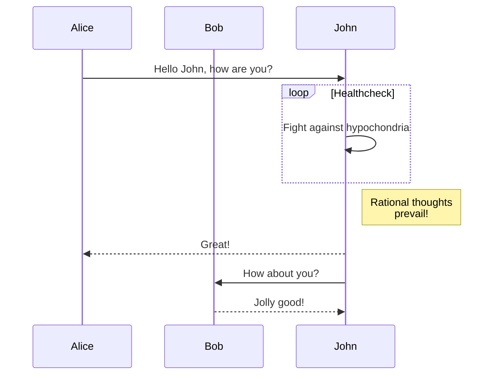

<style>
ul {
	list-style-type: disc;
	margin:
}
ol {
	list-style-type: decimal;
}
</style>

### Guía completa de Markdown

Markdown es un lenguaje de marcado ligero que permite crear documentos de texto formateados de manera sencilla. Es ampliamente utilizado en plataformas como GitHub, foros y blogs.

---

## **Markdown Básico**

### Encabezados
Usa el símbolo `#` seguido de un espacio para crear encabezados. Puedes variar el tamaño añadiendo más `#`.

```markdown
# Encabezado Nivel 1
## Encabezado Nivel 2
### Encabezado Nivel 3
```

**Resultado:**
# Encabezado Nivel 1
## Encabezado Nivel 2
### Encabezado Nivel 3

---

### Énfasis
- **Negrita**: Usa `**texto**` o `__texto__`.
- *Cursiva*: Usa `*texto*` o `_texto_`.
- ***Negrita y cursiva***: Usa `***texto***` o `___texto___`.

```markdown
**Negrita**
*Cursiva*
***Negrita y cursiva***
```

**Resultado:**
**Negrita**
*Cursiva*
***Negrita y cursiva***

---

### Listas
1. **Listas ordenadas**:
   Usa números seguidos de un punto (`1.`).
   ```markdown
   1. Primer elemento
   2. Segundo elemento
   3. Tercer elemento
   ```
2. **Listas desordenadas**:
   Usa `-`, `+` o `*` como viñetas.
   ```markdown
   - Elemento A
   - Elemento B
   - Elemento C
   ```

**Resultado:**
1. Primer elemento
2. Segundo elemento
3. Tercer elemento

- Elemento A
- Elemento B
- Elemento C

---

### Enlaces
Usa el formato `[Texto del enlace](URL)`.

```markdown
[Visita Google](https://www.google.com)
```

**Resultado:**  
[Visita Google](https://www.google.com)

---

### Imágenes
El formato es similar al de enlaces, pero con un signo `!` al inicio:  
``

```markdown

```

**Resultado:**


---

### Código
- **Inline**: Rodea el código con comillas invertidas: `` `código` ``.
- **Bloques de código**: Usa tres comillas invertidas (\`\`\`) para múltiples líneas.
  ```markdown
  ```
  Bloque de código
  ```
  ```

---

## **Markdown Avanzado**

### Tablas
Crea tablas con `|` para separar columnas y `-` para los encabezados.

```markdown
| Encabezado 1 | Encabezado 2 | Encabezado 3 |
|--------------|--------------|--------------|
| Dato 1       | Dato 2       | Dato 3       |
| Dato A       | Dato B       | Dato C       |
```

**Resultado:**

| Encabezado 1 | Encabezado 2 | Encabezado 3 |
|--------------|--------------|--------------|
| Dato 1       | Dato 2       | Dato 3       |
| Dato A       | Dato B       | Dato C       |

---

### Citas
Usa `>` para citas.

```markdown
> Este es un bloque de cita.
```

**Resultado:**
> Este es un bloque de cita.

---

### Tareas
Para listas de tareas, usa `- [ ]` para pendientes y `- [x]` para completadas.

```markdown
- [ ] Tarea pendiente
- [x] Tarea completada
```

**Resultado:**
- [ ] Tarea pendiente
- [x] Tarea completada

---

## **Markdown Extendido (Gráficos y Otros)**

### Diagramas con Markdown
Diagramas utilizando mermaid

#### Ejemplo: Diagrama de flujo

````txt

````

**Resultado:**


---

### MathJax (Fórmulas Matemáticas)
Para ecuaciones matemáticas, usa `$` para fórmulas inline y `$$` para bloques.

```markdown
Inline: $E=mc^2$
Bloque:
$$
E = mc^2
$$
```

**Resultado:**
Inline: \(E=mc^2\)
Bloque:

\[
E = mc^2
\]

---

### Comentarios
Markdown no tiene una sintaxis nativa para comentarios, puedes usar HTML:

```markdown
<!-- Esto es un comentario -->
```

